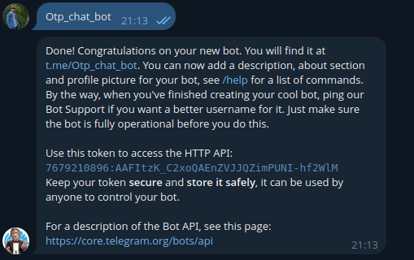
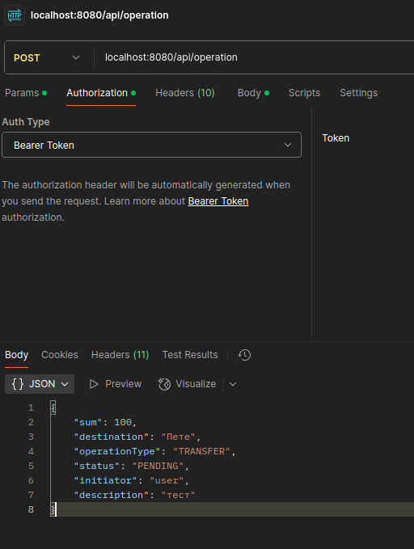

# Запуск

Для запуска требуется запущенная БД postgres. Для этого в docker поднимаем БД с помощью

```docker run --name otp-service -e POSTGRES_USER=postgres -e POSTGRES_PASSWORD=postgres -e POSTGRES_DB=otp -p 5432:5432 -d postgres:latest```

# Требования

**БД**

Пользователи (хранит логин пользователя, его пароль в зашифрованном виде, а также его роль).
Конфигурация OTP-кода (количество записей в ней никогда не должно превышать 1).
Таблица OTP-кодов (может содержать идентификатор операции в привязке к OTP-коду, но также допускается вынести логику работы с операциями в отдельную таблицу).

**API**

Для регистрации и аутентификации пользователей необходимо реализовать соответствующее API, которое должно минимально выполнять следующие операции:

**Регистрация нового пользователя.**

У пользователей может быть две роли: либо администратор, либо простой пользователь. Если администратор уже существует, то регистрация второго администратора должна быть невозможной.
Логин зарегистрированного пользователя.
Данная операция должна возвращать токен с ограниченным сроком действия для осуществления аутентификации и авторизации пользователя.


**Требования к каналам рассылки сгенерированных кодов**

Пользователи смогут получать защитные коды через различные каналы, что обеспечит гибкость и удобство в использовании сервиса. Для реализации этой функциональности необходимо учесть следующие требования:

Отправка кода по SMS — вам предстоит использовать эмулятор для отправки SMS, чтобы протестировать функционал. Это позволит имитировать процесс получения кодов без необходимости использования реальных SMS.
Отправка кода по Email — коды можно будет отправлять как на эмулятор, так и на реальные почтовые адреса. Это обеспечит пользователям возможность получать коды на удобный для них почтовый ящик.
Отправка кода через Telegram — с помощью Telegram API вы создадите бота, который будет отправлять коды пользователям. Это позволит мгновенно доставлять коды через популярное приложение для обмена сообщениями.
Сохранение кода в файл — реализуйте возможность сохранения сгенерированных кодов в файл.
Требования к структуре приложения
Приложение должно иметь три основных слоя:

**Слой API, содержащий обработчики HTTP-запросов.**

Слой API (хэндлеров или контроллеров) должен быть выполнен с помощью пакета com.sun.net.httpserver, встроенного в Java начиная с версии SE 6. Также допускается использование Spring MVC.
Слой сервисов, содержащий в себе основную бизнес-логику приложения.
Слой DAO, содержащий в себе классы, осуществляющие выполнение запросов к БД.
Остальные требования к функционалу
Необходимо реализовать механизм, который будет отмечать просроченные OTP-коды раз в определенный интервал времени и присваивать им статус EXPIRED.
Необходимо настроить логирование в приложении с помощью любой понравившейся вам библиотеки из модуля про логирование.
Приложение должно использовать систему сборки Gradle или Maven.

# Тесты

В качестве тестов для проверки функционала я использовал интеграционные тесты, т.к тесты условиями задачи вообще не требовались,
то в некоторых местах я отступил от общепринятых правил исключительно для того, чтобы проверить приложение. Конечно, при 
других обстоятельствах я бы уделил им больше внимания =)

## Телеграм
Отправка отп через телеграм. Для тестирования данного функционала разработан тест [TelegramServiceIntegrationTest.java](src%2Ftest%2Fjava%2Fru%2Fotp%2Fservice%2Fintegration%2FTelegramServiceIntegrationTest.java) 

Для данного теста нужно получить ид бота

Для этого мной был зарегистрирован чат бот 



и получен его чат ид

https://api.telegram.org/bot7679210896:AAFItzK_C2xoQAEnZVJJQZimPUNI-hf2WlM/getUpdates
``
{"ok":true,"result":[{"update_id":291886601,
"message":{"message_id":1,"from":{"id":978297678,"is_bot":false,"first_name":"\u041d\u0438\u043a\u0438\u0442\u0430","last_name":"\u0411\u043e\u0440\u043e\u0434\u0443\u043b\u0438\u043d","username":"nborodulin","language_code":"ru"},"chat":{"id":978297678,"first_name":"\u041d\u0438\u043a\u0438\u0442\u0430","last_name":"\u0411\u043e\u0440\u043e\u0434\u0443\u043b\u0438\u043d","username":"nborodulin","type":"private"},"date":1746472437,"text":"/start","entities":[{"offset":0,"length":6,"type":"bot_command"}]}}]}
``
Вот результаты прохождения теста указанного выше


## Авторизация

Для авторизации используется jwt токен, на нее также написаны интеграционные тесты [AuthTests.java](src%2Ftest%2Fjava%2Fru%2Fotp%2Fservice%2Fintegration%2FAuthTests.java)