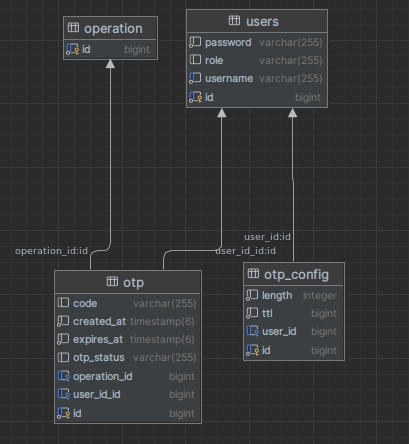
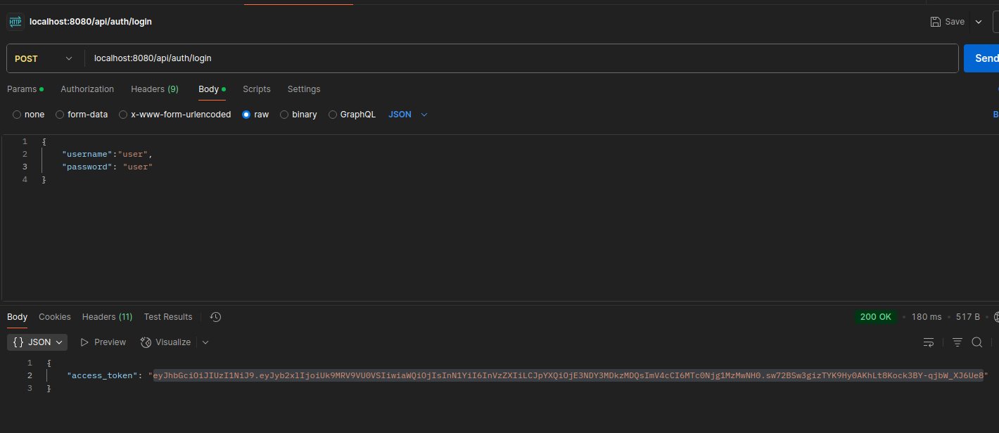
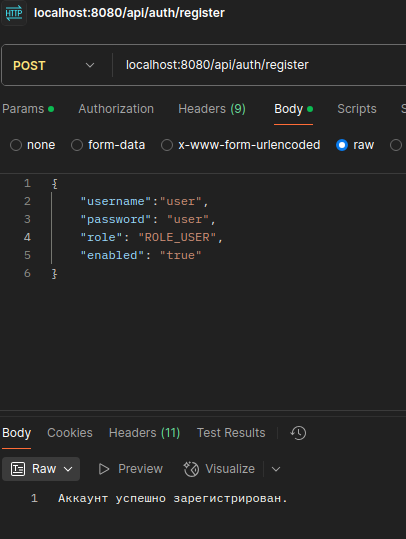
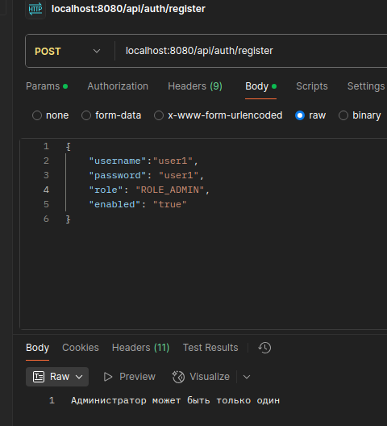
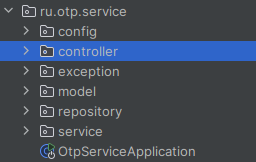
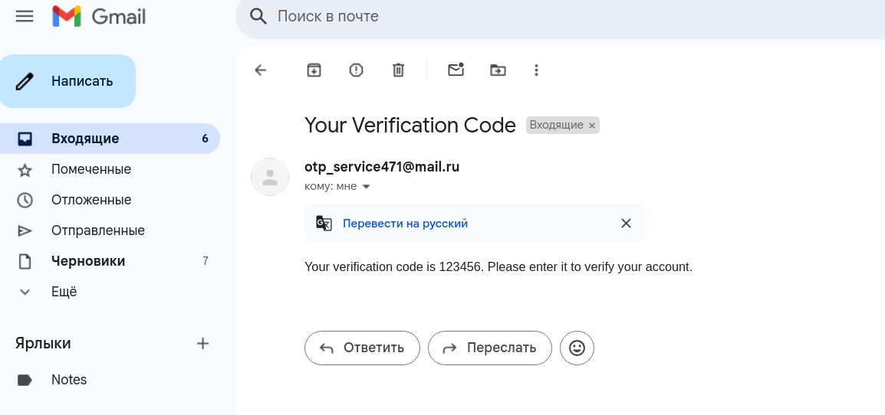
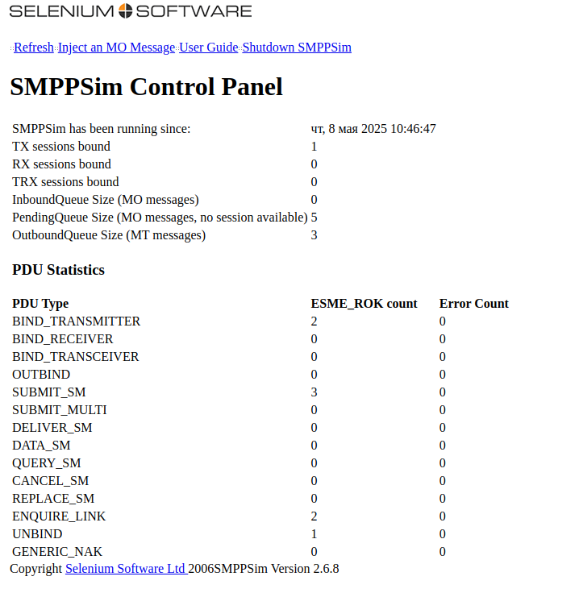
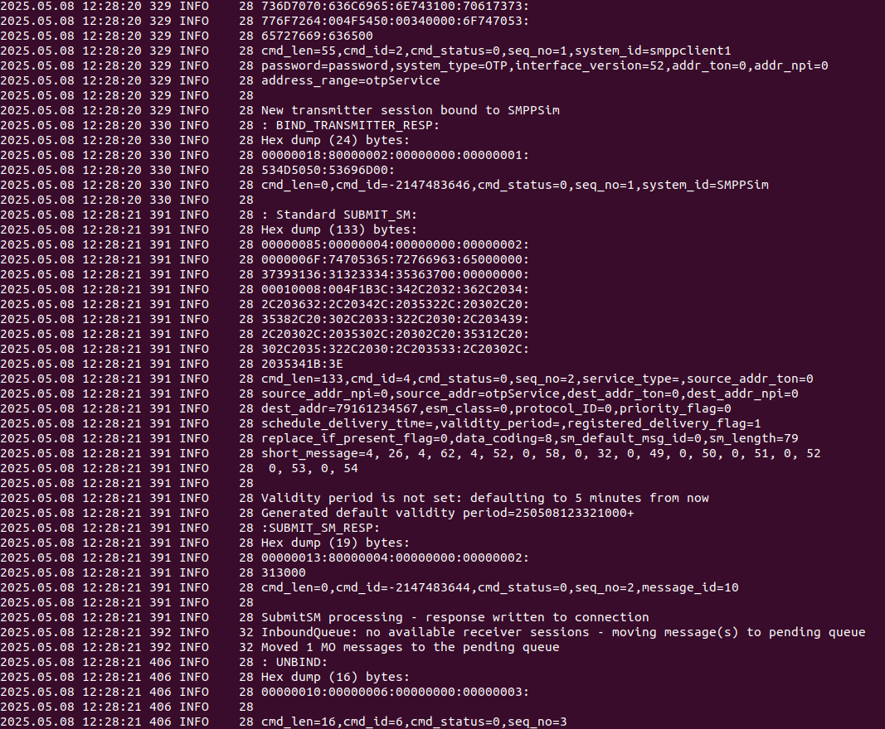

# Запуск

Для запуска требуется запущенная БД postgres. Для этого в docker поднимаем БД с помощью

```docker run --name otp-service -e POSTGRES_USER=postgres -e POSTGRES_PASSWORD=postgres -e POSTGRES_DB=otp -p 5432:5432 -d postgres:latest```

# Требования

**БД**

_Пользователи (хранит логин пользователя, его пароль в зашифрованном виде, а также его роль).
Конфигурация OTP-кода (количество записей в ней никогда не должно превышать 1).
Таблица OTP-кодов (может содержать идентификатор операции в привязке к OTP-коду, но также допускается вынести логику
работы с операциями в отдельную таблицу)._

В приложении реализована след структура данных



**API**

_Для регистрации и аутентификации пользователей необходимо реализовать соответствующее API, которое должно минимально
выполнять следующие операции:_

**Регистрация нового пользователя.**

_У пользователей может быть две роли: либо администратор, либо простой пользователь. Если администратор уже существует,
то регистрация второго администратора должна быть невозможной.
Логин зарегистрированного пользователя.
Данная операция должна возвращать токен с ограниченным сроком действия для осуществления аутентификации и авторизации
пользователя._







**Требования к каналам рассылки сгенерированных кодов**

_Пользователи смогут получать защитные коды через различные каналы, что обеспечит гибкость и удобство в использовании
сервиса. Для реализации этой функциональности необходимо учесть следующие требования:

Отправка кода по SMS — вам предстоит использовать эмулятор для отправки SMS, чтобы протестировать функционал. Это
позволит имитировать процесс получения кодов без необходимости использования реальных SMS.
Отправка кода по Email — коды можно будет отправлять как на эмулятор, так и на реальные почтовые адреса. Это обеспечит
пользователям возможность получать коды на удобный для них почтовый ящик.
Отправка кода через Telegram — с помощью Telegram API вы создадите бота, который будет отправлять коды пользователям.
Это позволит мгновенно доставлять коды через популярное приложение для обмена сообщениями.
Сохранение кода в файл — реализуйте возможность сохранения сгенерированных кодов в файл._

В приложении реализованы все описанные выше каналы рассылки, пруфу работоспособности ниже (см. раздел тесты).

**Слой API, содержащий обработчики HTTP-запросов.**

_Слой API (хэндлеров или контроллеров) должен быть выполнен с помощью пакета com.sun.net.httpserver, встроенного в Java
начиная с версии SE 6. Также допускается использование Spring MVC.
Слой сервисов, содержащий в себе основную бизнес-логику приложения.
Слой DAO, содержащий в себе классы, осуществляющие выполнение запросов к БД.
Остальные требования к функционалу
Необходимо реализовать механизм, который будет отмечать просроченные OTP-коды раз в определенный интервал времени и
присваивать им статус EXPIRED.
Необходимо настроить логирование в приложении с помощью любой понравившейся вам библиотеки из модуля про логирование.
Приложение должно использовать систему сборки Gradle или Maven._

В приложении используется Gradle, для устаревания записей используется шедулер (см.ниже). Логирование также реализовано.
Все описанные выше слои в приложении присутствуют



# Общее описание приложения

1. В задаче не было требований по запуску, поэтому запускаем локально)
2. Регистрируем пользователя и логинимся `POSTlocalhost:8080/api/auth/register`

```json
{
"username":"user",
"password": "user",
"role": "ROLE_USER",
"enabled": "true"
}
```

`POST localhost:8080/api/auth/login`

```json
{
"username":"user",
"password": "user"
}
```

3. После регистрации и логина пользователя реализованной согласно требованиям выше, необходимо создать операцию
   `POST localhost:8080/api/operation`

```json
{
"sum": 100,
"destination" : "Пете",
"date":"20.02.2025",
"operationType": "TRANSFER",    
"status": "PENDING",
"initiator": "Вася",
"description": "тест"
}
```

4. Далее генерируем отп код `POST localhost:8080/api/operation/1/otp/generate`


По умолчанию отп записывается в файл `logs/otp_codes.log`. Проверяем. Настройки времени жизни токена и его длинны
берутся их application.properties `otp.ttl.*`

5. Осуществляем валидацию `GET localhost:8080/api/operation/1/otp/validate?code=7654`. Проверяется, что операция есть,
   есть код и что он не устарел.

6. Для работы администратора реализовано апи `/api/admin/`. В нем мы можем создать, редактировать отп конфигурацию для
   пользователя, посмотреть всех пользователей кроме администраторов, удалить пользователя включая его отп коды, а также сменить тип доставки отп. Например,

`POST localhost:8080/api/admin/config/1`

```json
{
  "ttl": 60001,
  "length": 6,
  "deliveryType": "MAIL",
  "userId": 1
}
```

# Тесты

В качестве тестов для проверки функционала я использовал интеграционные тесты, т.к тесты условиями задачи вообще не
требовались,
то в некоторых местах я отступил от общепринятых правил исключительно для того, чтобы проверить приложение. Конечно, при
других обстоятельствах я бы уделил им больше внимания =)

## Телеграм

Отправка отп через телеграм. Для тестирования данного функционала разработан
тест [TelegramServiceIntegrationTest.java](src%2Ftest%2Fjava%2Fru%2Fotp%2Fservice%2Fintegration%2FTelegramServiceIntegrationTest.java)

Для данного теста нужно получить ид бота

Для этого мной был зарегистрирован чат бот


и получен его чат ид

https://api.telegram.org/bot7679210896:AAFItzK_C2xoQAEnZVJJQZimPUNI-hf2WlM/getUpdates
``
{"ok":true,"result":[{"update_id":291886601,
"message":{"message_id":1,"from":{"id":978297678,"is_bot":false,"first_name":"\u041d\u0438\u043a\u0438\u0442\u0430","last_name":"\u0411\u043e\u0440\u043e\u0434\u0443\u043b\u0438\u043d","username":"nborodulin","language_code":"ru"},"chat":{"id":978297678,"first_name":"\u041d\u0438\u043a\u0438\u0442\u0430","last_name":"\u0411\u043e\u0440\u043e\u0434\u0443\u043b\u0438\u043d","username":"nborodulin","type":"private"},"date":1746472437,"text":"/start","entities":[{"offset":0,"length":6,"type":"bot_command"}]}}]}
``
Вот результаты прохождения теста указанного выше


## Авторизация

Для авторизации используется jwt токен, на нее также написаны интеграционные
тесты [AuthTests.java](src%2Ftest%2Fjava%2Fru%2Fotp%2Fservice%2Fintegration%2FAuthTests.java)

## Срок жизни токенов

Для проверка срока жизни токенов создан шедулер ExpirationService и написан тест на проверку того, что он срабатывает

[ExpirationServiceIntegrationTest.java](src%2Ftest%2Fjava%2Fru%2Fotp%2Fservice%2Fintegration%2FExpirationServiceIntegrationTest.java)

## Отправка через почту

Для проверки отправки через почту
реализован [EmailServiceIntegrationTest.java](src/test%2Fjava%2Fru%2Fotp%2Fservice%2Fintegration%2FEmailServiceIntegrationTest.java)

В тесте нужно поменять адрес назначения на актуальный, чтобы получить письмо на свою почту



## Отправка СМС

Для проверки написан
тест [SmsServiceTest.java](src%2Ftest%2Fjava%2Fru%2Fotp%2Fservice%2Fintegration%2FSmsServiceTest.java),
а также поднят эмулятор согласно описания задания. Ниже мы видим на панели мониторинга, что эмулятор сообщения принимает
и обрабатывает, а также логи. По логам мы видим, что сервер сообщение обрабатывает, но не отправляет т.к это эмулятор и
отправка отключена.



